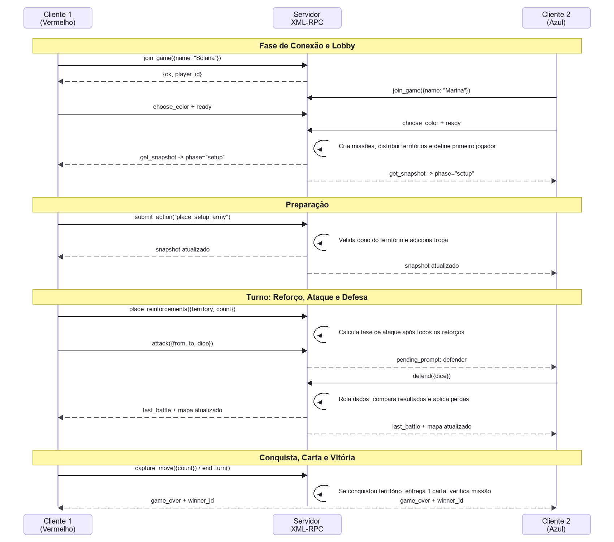

# Risk Distribuído - Aplicação Distribuída C/S com RPC

<p align="center">
  
  
  
  
  
</p>

---

## Projeto: Risk Distribuído

Este repositório contém o código-fonte de uma versão distribuída do jogo **Risk**, desenvolvida pela aluna **Solana Marina Bonfim Lemos** como trabalho da disciplina de **Sistemas Distribuídos**. A aplicação segue um modelo cliente-servidor, onde um servidor centralizado em Python mantém o estado autoritativo da partida e dois clientes com interface gráfica em Pygame se conectam para jogar pela rede local.

---

### 1. Documentação do Software

#### 1.1. Propósito do Software

O propósito principal deste software é demonstrar, de forma prática, conceitos fundamentais de sistemas distribuídos, comunicação remota e separação entre cliente e servidor.

Objetivos:

* Implementar uma versão simplificada e jogável de Risk com mapa, continentes, países, tropas, cartas, missões secretas e dados.
* Usar **XML-RPC** como mecanismo de chamada de procedimento remoto em Python, fazendo um paralelo direto com a ideia de **RMI** usada em Java.
* Manter o servidor como autoridade única do estado do jogo, evitando que clientes decidam regras localmente.
* Permitir que dois clientes diferentes coexistam em processos separados, conectados ao mesmo servidor.
* Separar claramente as responsabilidades: um servidor "inteligente" e stateful, e clientes de interface que apenas enviam ações e renderizam snapshots recebidos.

#### 1.2. Motivação da Escolha do Protocolo de Transporte (TCP)

Para este jogo, o TCP é utilizado indiretamente pelo XML-RPC, que trafega sobre HTTP. Ele foi escolhido em detrimento de UDP por três motivos cruciais:

1. **Confiabilidade:** Risk é baseado em turnos e cada ação altera o estado global da partida. A perda de uma chamada como `submit_action("attack", ...)` ou de uma resposta de `get_snapshot(...)` poderia deixar cliente e servidor com visões inconsistentes. O TCP garante a entrega confiável dos dados.

2. **Ordenação:** As ações precisam ser processadas na ordem correta. Um reforço deve acontecer antes de um ataque, uma defesa deve responder ao ataque pendente e a conquista deve ocorrer antes da carta de território. O TCP preserva a ordem dos dados dentro da conexão.

3. **Tolerância à Latência:** Risk não depende de reflexos em tempo real. Uma pequena latência de rede não prejudica a jogabilidade, enquanto a confiabilidade e a consistência são essenciais.

#### 1.3. Funcionamento do Software (Arquitetura)

A aplicação é dividida em dois componentes principais que se comunicam pela rede usando chamadas remotas XML-RPC.

##### Servidor

O servidor é o "cérebro" do jogo. Ele não possui interface gráfica e sua responsabilidade é manter o estado oficial da partida.

* **Concorrência:** O servidor usa `ThreadingXMLRPCServer`, que atende chamadas XML-RPC em threads separadas. Isso permite que dois clientes façam requisições sem travar o processo inteiro. O estado compartilhado do jogo é protegido por `threading.RLock` dentro de `RiskGame`.

* **Objeto Remoto:** A classe `GameRpcService`, em `risk_dist/server/network.py`, funciona como o objeto remoto exposto aos clientes. Em Java, ela seria equivalente a uma implementação como `RiskRemoteImpl`.

* **Gerenciamento de Estado:** A classe `RiskGame`, em `risk_dist/server/game.py`, armazena:

  * Jogadores conectados, cores e estado de pronto.
  * Missões secretas.
  * Dono e quantidade de tropas de cada território.
  * Fase atual da partida.
  * Baralho de cartas, descarte e mão dos jogadores.
  * Última batalha, dados rolados e log de eventos.

* **Lógica:** Quando o servidor recebe uma ação via `submit_action`, ele valida se é a vez correta, se a fase permite aquela ação e se as regras do Risk foram respeitadas. Só então atualiza o estado, incrementa a versão do snapshot e disponibiliza a nova visão aos clientes.

##### Cliente

O cliente é a interface visual com a qual o jogador interage. Ele não executa a lógica autoritativa da partida.

* **Máquina de Estados:** O cliente opera em uma máquina de estados:

  * `menu`: Tela inicial para hospedar ou entrar em uma partida.
  * `lobby`: Escolha de cor e confirmação de pronto.
  * `game`: Tela principal com mapa, cartas, missão, regras, dados, logs e botões de ação.

* **Comunicação RPC:** O cliente usa `RpcGameClient`, em `risk_dist/client/network.py`, como stub de rede. Esse stub encapsula o `ServerProxy` do XML-RPC e oferece métodos simples como `choose_color`, `ready`, `poll_snapshot` e `submit_action`.

* **Atualização de Estado:** A interface não recebe eventos empurrados pelo servidor. Em vez disso, faz polling periódico com `get_snapshot(player_id, last_version)`. Se a versão mudou, o servidor devolve um snapshot novo; se não mudou, o cliente evita baixar estado repetido.

* **Renderização:** O cliente desenha o mapa em Pygame, mostra os territórios coloridos por jogador, cartas, missão secreta do próprio jogador, dados de ataque/defesa, regras paginadas e orientações de turno.

#### 1.4. Requisitos Mínimos

**Servidor:**

* Python 3.13 ou superior.
* Porta TCP disponível, por padrão `5000`.
* Permissão do firewall para aceitar conexões dos clientes na rede local.
* Dependências instaladas com `python -m pip install -r requirements.txt`.

**Cliente:**

* Python 3.13 ou superior.
* Biblioteca Pygame.
* Acesso ao IP e à porta do servidor.
* Permissão do firewall para comunicação com o servidor.
* Resolução de tela suficiente para exibir o mapa e as barras laterais.

---

### 2. Protocolo da Camada de Aplicação

O protocolo define como o cliente e o servidor se comunicam.

#### 2.1. Formato e Transporte

* **Transporte:** As chamadas são trocadas sobre TCP, usando HTTP por meio da biblioteca XML-RPC do Python.
* **Formato:** O XML-RPC serializa chamadas remotas, argumentos e retornos em XML. No código Python, essas chamadas aparecem como métodos comuns.
* **Endpoint:** O serviço remoto fica disponível no caminho `/RPC2`, por exemplo `http://127.0.0.1:5000/RPC2`.

**Estrutura Conceitual da Chamada Remota:**

```python
resultado = proxy.nome_do_metodo(arg1, arg2, ...)
```

Exemplo real:

```python
resultado = proxy.submit_action(player_id, "attack", {"from": "brazil", "to": "peru", "dice": 3})
```

Em Java RMI, a ideia equivalente seria obter um stub remoto e chamar um método da interface:

```java
RiskRemote jogo = (RiskRemote) registry.lookup("RiskRemote");
jogo.submitAction(playerId, "attack", payload);
```

#### 2.2. Fluxo de Estados e Mensagens

Um jogo típico segue este fluxo:

**Conexão:**

* Cliente 1 -> `join_game(name="JogadorA")`
* Servidor -> `{"ok": true, "player_id": "..."}`
* Cliente 2 -> `join_game(name="JogadorB")`
* Servidor -> `{"ok": true, "player_id": "..."}`

**Lobby e Início do Jogo:**

* Cliente 1 -> `choose_color(player_id, "red")`
* Cliente 2 -> `choose_color(player_id, "blue")`
* Cliente 1 -> `ready(player_id)`
* Cliente 2 -> `ready(player_id)`
* Servidor distribui missões, territórios iniciais, tropas e define o primeiro jogador.
* Clientes -> `get_snapshot(player_id, last_version)` para receber `phase="setup"`.

**Preparação:**

* Cliente da vez -> `submit_action(player_id, "place_setup_army", {"territory_id": "brazil"})`
* Servidor valida dono do território e adiciona 1 tropa.
* Clientes -> `get_snapshot(...)` para ver o mapa atualizado.

**Turno de Jogo:**

* Cliente da vez posiciona reforços:

```python
submit_action(player_id, "place_reinforcements", {"territory_id": "brazil", "count": 1})
```

* Após posicionar todos os reforços, o servidor muda para `phase="attack"`.
* Cliente atacante escolhe origem, destino e dados:

```python
submit_action(player_id, "attack", {"from": "brazil", "to": "peru", "dice": 3})
```

* Servidor cria uma defesa pendente para o outro jogador.
* Cliente defensor responde:

```python
submit_action(player_id, "defend", {"dice": 1})
```

* Servidor rola dados, calcula perdas e envia `last_battle` no snapshot.

**Conquista e Cartas:**

* Se o defensor perder a última tropa, o servidor cria uma ação pendente de conquista.
* Atacante -> `submit_action(player_id, "capture_move", {"count": 3})`
* Se conquistou pelo menos um território no turno, o jogador recebe 1 carta ao encerrar o turno:

```python
submit_action(player_id, "end_turn", {})
```

**Fim de Jogo:**

* O servidor verifica a missão secreta após ações relevantes.
* Ao cumprir a missão, o snapshot passa a conter `phase="game_over"` e `winner_id`.
* Os dois clientes recebem o estado final via `get_snapshot(...)`.

**Desconexão:**

* Cliente -> `leave_game(player_id)` ao fechar corretamente.
* Se um jogador desconectar durante a partida, o servidor declara o outro jogador vencedor.

#### 2.3. Dicionário de Mensagens

**Chamadas Cliente -> Servidor (C2S)**

**join_game**

* **Quando:** Enviada pelo cliente ao conectar no servidor.
* **Propósito:** Registrar o jogador na partida.
* **Parâmetros:**

```python
join_game(name: str)
```

* **Retorno:**

```json
{"ok": true, "player_id": "uuid-do-jogador"}
```

**choose_color**

* **Quando:** Enviada no lobby, antes do jogo começar.
* **Propósito:** Escolher a cor do jogador.
* **Parâmetros:**

```python
choose_color(player_id: str, color: str)
```

* **Retorno:**

```json
{"ok": true}
```

**ready**

* **Quando:** Enviada depois da escolha de cor.
* **Propósito:** Informar que o jogador está pronto para começar.
* **Parâmetros:**

```python
ready(player_id: str)
```

* **Retorno:**

```json
{"ok": true}
```

**get_snapshot**

* **Quando:** Chamado periodicamente pelo cliente.
* **Propósito:** Buscar o estado atualizado da partida.
* **Parâmetros:**

```python
get_snapshot(player_id: str, last_version: int | None)
```

* **Retorno:**

```json
{
  "updated": true,
  "version": 12,
  "snapshot": {
    "phase": "attack",
    "current_player_id": "uuid",
    "territories": [],
    "players": [],
    "your_hand": [],
    "pending_prompt": null,
    "last_battle": null
  }
}
```

**submit_action**

* **Quando:** Enviada sempre que o jogador executa uma ação de jogo.
* **Propósito:** Encapsular ações de preparação, reforço, ataque, defesa, conquista, manobra, troca de cartas e fim de turno.
* **Parâmetros:**

```python
submit_action(player_id: str, action: str, payload: dict)
```

* **Ações suportadas:**

```text
place_setup_army
trade_cards
place_reinforcements
attack
defend
capture_move
fortify
end_attack_phase
end_turn
```

* **Exemplo de Payload:**

```json
{"from": "brazil", "to": "peru", "dice": 3}
```

**leave_game**

* **Quando:** Enviada quando o cliente fecha a janela ou sai da partida.
* **Propósito:** Avisar o servidor sobre a saída do jogador.
* **Parâmetros:**

```python
leave_game(player_id: str)
```

**Respostas Servidor -> Cliente (S2C)**

**Resultado de Sucesso**

* **Quando:** Retornado após uma chamada válida.
* **Propósito:** Confirmar que a ação foi aceita.

```json
{"ok": true}
```

**Resultado de Erro**

* **Quando:** Retornado quando a ação é inválida, fora de turno, fora de fase ou enviada por jogador incorreto.
* **Propósito:** Informar à interface o erro que deve ser exibido.

```json
{"ok": false, "error": "Não é a sua vez de atacar."}
```

**Snapshot Atualizado**

* **Quando:** Retornado por `get_snapshot` quando o estado mudou.
* **Propósito:** Enviar ao cliente a visão atual da partida.

```json
{
  "updated": true,
  "version": 30,
  "snapshot": {
    "phase": "reinforcement",
    "status_message": "Turno de JogadorA: 5 tropas de reforço para posicionar.",
    "current_player_id": "uuid-do-jogador-atual",
    "winner_id": null,
    "territories": [],
    "players": [],
    "your_hand": [],
    "your_trade_sets": [],
    "must_trade": false,
    "pending_prompt": null,
    "last_battle": null,
    "log": []
  }
}
```

**Snapshot Sem Mudança**

* **Quando:** Retornado por `get_snapshot` quando `last_version` ainda é a versão atual.
* **Propósito:** Evitar tráfego desnecessário.

```json
{
  "updated": false,
  "version": 30,
  "snapshot": null
}
```

**Prompt de Defesa**

* **Quando:** Retornado dentro do snapshot do defensor após um ataque.
* **Propósito:** Informar que o defensor deve escolher 1 ou 2 dados.

```json
{
  "type": "defend",
  "target_player_id": "uuid-do-defensor",
  "from": "brazil",
  "to": "peru",
  "attack_dice": 3,
  "max_defense_dice": 2
}
```

**Última Batalha**

* **Quando:** Retornada no snapshot após a defesa.
* **Propósito:** Mostrar os dados rolados e perdas de tropas.

```json
{
  "attacker": "JogadorA",
  "defender": "JogadorB",
  "attacker_rolls": [6, 4, 2],
  "defender_rolls": [5, 3],
  "attacker_losses": 0,
  "defender_losses": 2,
  "from": "brazil",
  "to": "peru"
}
```

**Fim de Jogo**

* **Quando:** Retornado no snapshot quando uma missão secreta é cumprida.
* **Propósito:** Encerrar a partida e exibir o vencedor.

```json
{
  "phase": "game_over",
  "winner_id": "uuid-do-vencedor",
  "status_message": "JogadorA completou a missão secreta."
}
```

#### 2.4. Diagrama de Sequência (Fluxo de Mensagens)

O diagrama abaixo ilustra a troca simplificada de mensagens desde a conexão até o fim do jogo.


